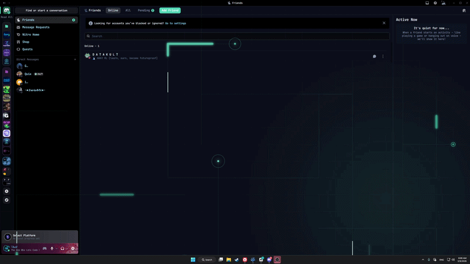
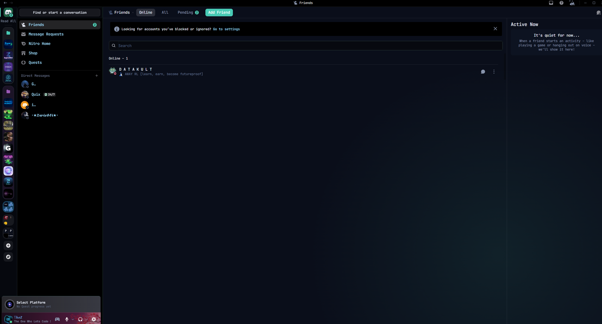
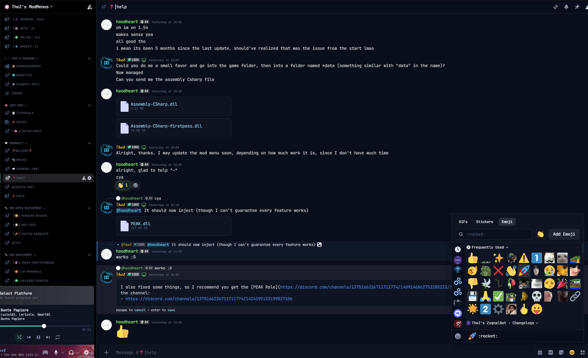
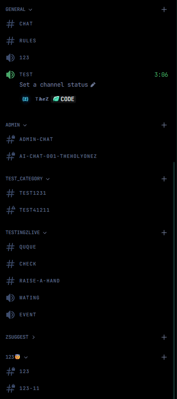
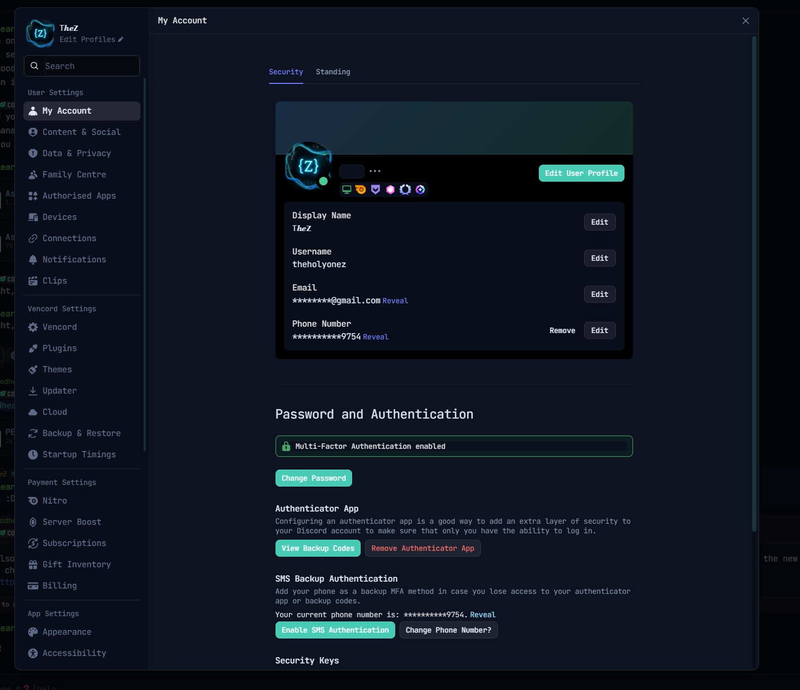
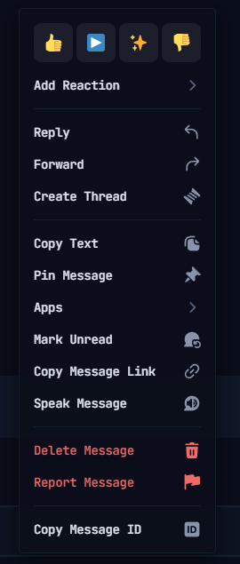
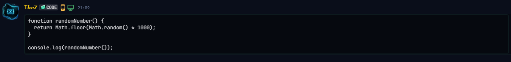
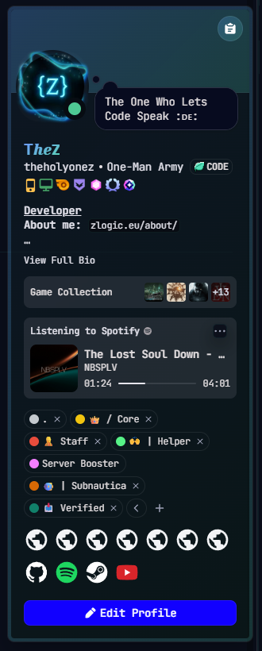
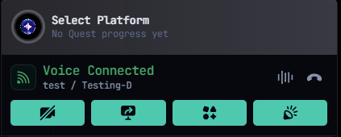
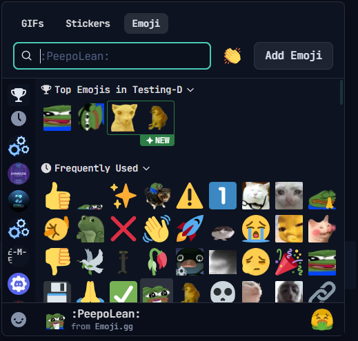

# TheHolyOneZ-Dream

> *A VSCodium-soul Discord theme. Deep navy, drifting aurora, VSCode teal. Smooth. Monospace. Yours. Circuit traces optional.*

   

---

## Gallery

<table>
  <tr>
    <td align="center" width="50%">
      
      <br/>
      <sub><b>✦ With background effect</b></sub>
    </td>
    <td align="center" width="50%">
      
      <br/>
      <sub><b>Without background effect</b></sub>
    </td>
  </tr>
  <tr>
    <td align="center" colspan="2">
      <sup>Toggle by setting <code>--cx-bg-effect: 1</code> (on) or <code>0</code> (off) at the top of the theme file</sup>
    </td>
  </tr>
</table>

<br/>

<table>
  <tr>
    <td align="center" width="50%">
      
      <br/>
      <sub><b>Overview</b></sub>
    </td>
    <td align="center" width="50%">
      
      <br/>
      <sub><b>Chat</b></sub>
    </td>
  </tr>
  <tr>
    <td align="center" width="50%">
      
      <br/>
      <sub><b>Sidebar &amp; Channels</b></sub>
    </td>
    <td align="center" width="50%">
      
      <br/>
      <sub><b>Settings</b></sub>
    </td>
  </tr>
  <tr>
    <td align="center" width="50%">
      
      <br/>
      <sub><b>Context Menu</b></sub>
    </td>
    <td align="center" width="50%">
      
      <br/>
      <sub><b>Code Blocks</b></sub>
    </td>
  </tr>
</table>

<details>
  <summary><b>More screenshots</b></summary>
  <br/>
  <table>
    <tr>
      <td align="center" width="33%">
        
        <br/>
        <sub><b>Profile Popout</b></sub>
      </td>
      <td align="center" width="33%">
        
        <br/>
        <sub><b>Voice Channel</b></sub>
      </td>
      <td align="center" width="33%">
        
        <br/>
        <sub><b>Emoji Picker</b></sub>
      </td>
    </tr>
  </table>
</details>

---

## Philosophy

Not a hacker theme. Not neon green on black.  
This is the feeling of settling into VSCodium at midnight — familiar, focused, yours.

Deep navy backgrounds. JetBrains Mono everywhere. Two soft aurora blobs drift constantly behind the UI — a blue one top-left, a teal one bottom-right — giving the whole thing a quiet, ambient glow. Every interaction has a smooth, deliberate transition.

A barely-visible cyan mesh grid and animated PCB circuit traces are available as an optional overlay. Toggle them with one variable.

---

## Features

- **JetBrains Mono** — monospace font across the entire UI, with Cascadia Code and Fira Code as fallbacks
- **Circuit trace effect** — PCB-style right-angle paths with racing glow streaks and endpoint flashes (toggleable)
- **Drifting aurora** — three slow-moving radial blobs in the base background for subtle ambient depth
- **Full brand recolor** — Discord's blurple replaced with `#4ec9b0` (VSCode teal) throughout
- **Smooth micro-animations** — channels, server icons, buttons, reactions, badges, switches
- **Zero lag** — no `backdrop-filter` on structural panels, only Discord CSS variables for backgrounds
- **Dark & precise** — carefully tuned 6-step neutral scale, muted timestamps, uppercase category labels
- **Fully customizable** — all colors, fonts, and effects controlled by clean CSS variables at the top of the file

---

## Installation

### BetterDiscord

1. Download [`TheHolyOneZ-Dream.theme.css`](./TheHolyOneZ-Dream.theme.css)
2. Move it to your themes folder:
   - **Windows:** `%appdata%\BetterDiscord\themes\`
   - **macOS:** `~/Library/Application Support/BetterDiscord/themes/`
   - **Linux:** `~/.config/BetterDiscord/themes/`
3. Open Discord → **Settings → BetterDiscord → Themes**
4. Enable **TheHolyOneZ-Dream**

### Vencord

1. Download [`TheHolyOneZ-Dream.theme.css`](./TheHolyOneZ-Dream.theme.css)
2. Move it to your themes folder:
   - **Windows:** `%appdata%\Vencord\themes\`
   - **macOS:** `~/Library/Application Support/Vencord/themes/`
   - **Linux:** `~/.config/Vencord/themes/`
3. Open Discord → **Settings → Vencord → Themes**
4. Enable **TheHolyOneZ-Dream**

### Online / Web (Vencord)

No download needed — paste this directly into **Settings → Vencord → Themes → Online Themes**:

```
https://raw.githubusercontent.com/TheHolyOneZ/TheHolyOneZ-Dream/main/TheHolyOneZ-Dream.theme.css
```

---

## Palette

| Role | Hex | Preview |
|---|---|---|
| Background void | `#07090f` |  |
| Background base | `#0b0e1a` |  |
| Background panel | `#131829` |  |
| Cyan accent | `#4ec9b0` |  |
| Blue secondary | `#5294e2` |  |
| Sky (links) | `#9cdcfe` |  |
| Purple (streams) | `#c792ea` |  |
| Text normal | `#a8b2c8` |  |
| Text muted | `#5d6a86` |  |
| Online | `#4ec994` |  |
| Idle | `#e0af68` |  |
| DND | `#f7768e` |  |

---

## Customization

### Toggle the background effect

Open `TheHolyOneZ-Dream.theme.css` in any text editor and find the top of `:root`:

```css
--cx-bg-effect: 0; /* ← change to 1 to enable */
```

| Value | Result |
|---|---|
| `1` | Circuit trace animation **on** |
| `0` | Circuit trace animation **off** (default) |

> ⚠️ The circuit trace effect may cause performance issues on lower-end machines. It's off by default for this reason.

Save the file, then press **Ctrl+R** in Discord to reload.

### Other variables

```css
:root {
  --cx-cyan:   #4ec9b0;  /* primary accent — change this to shift the whole theme */
  --cx-blue:   #5294e2;  /* secondary accent */
  --cx-bg-0:   #0b0e1a;  /* darkest background */
  --cx-font:   'JetBrains Mono', monospace;  /* swap font here */
}
```

---

## Compatibility

- ✅ BetterDiscord (stable)
- ✅ Vencord (stable)
- ✅ Discord dark mode
- ⚠️ Discord light mode (usable, not optimized)

---

## License

MIT — do whatever you want, just don't claim you made it from scratch.

---

<p align="center">made with too much coffee by <strong>TheHolyOneZ</strong></p>
